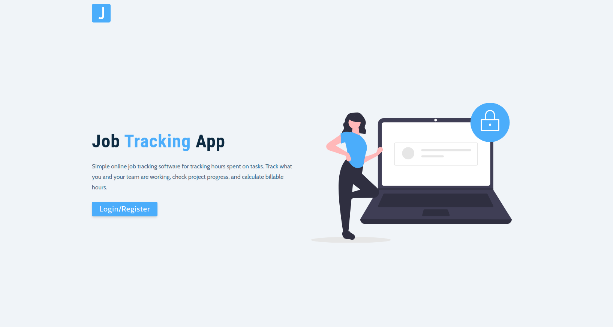

# JobsManager App

## This project is under development.

### About

This is Jobs Manager app that allows the user to track the time spent on projects, tasks, and client work. Track the job hours on any device, visualize the progress, budget utilization, and billable hours.

The app uses its own API to interact with the backend.

### Goal

To create job tracker app that lets you track work hours across projects.

### Features

- It allows the user to create, update, delete and see all the jobs.
- it shows information and stats about the job.
- it allows the user to track time on projects.

### Built using

For the last few months I have been working with React and Node/Express, So this is what I am using to build this app:

- ReactJs: Front-end framework
- Node/Express: Back-end framework
- Redux: State management
- MongoDB: Cloud database

### Feedback

Like I just mentioned this project is under development, if you find or see some issues please open one issue and if you need/want a feature you can also make a request for said feature :)

### Running locally

1. Open a terminal and clone the repo using the following command: `git clone`
2. Install the dependencies for the Back-end using the following command: `npm i`
3. Install the dependencies for the Front-end using the following command: `cd client && npm i`
4. And run the following command: `npm start`
5. Then visit http://localhost:5000/
